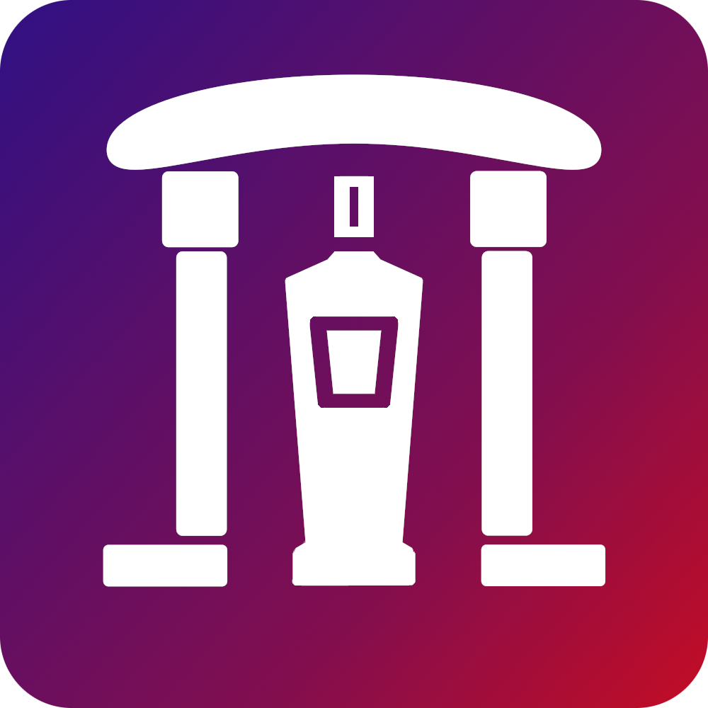

<p align="center">
  
</p>

# Zalana Witryna 🎮

**Zalana Witryna** is the official website for the **Gumciaczki** community, part of the **Zalana Piwnica** Discord server.

**Note:** The user interface is in Polish language.

## ✨ Features

- **Responsive Design**: Optimized for desktop and mobile devices
- **Interactive Navigation**: Smooth scrolling with scroll progress indicator
- **Community Showcase**: Dynamic image slider displaying gaming sessions
- **Radio Section**: Embedded player for community radio shows
- **Minecraft Server Info**: Live server status, download links, and server details
- **Modern Animations**: CSS animations and transitions throughout the site
- **Dark Theme**: Stylish dark color scheme with gradient backgrounds

## 🛠️ Tech Stack

- **Framework**: [Astro](https://astro.build/)
- **Language**: TypeScript
- **Styling**: CSS with CSS Custom Properties and animations
- **Fonts**: Source Code Pro, Ubuntu, Minecraft, Brandish

## 📝 Environment Variables

- `AUTHOR_URL`: Link to the website author's profile/portfolio
- `OG_IMAGE_URL`: Open Graph image URL for social media sharing
- `RADIO_PLAYER_URL`: URL for the embedded radio player
- `MC_FILES_CDN`: CDN URL for Minecraft server files and downloads
- `MC_ADDRESS`: Minecraft server address (IP:port format)

## 🏗️ Development

### Prerequisites

- Node.js 18+
- npm or yarn

### Instalation

```bash
git clone <repository-url>
cd zalana-www
npm install
cp .env.example .env
# configure .env
npm run dev
```

### Available Scripts

- `npm run dev` - Start development server
- `npm run build` - Build for production
- `npm run preview` - Preview production build locally

### Code Style

- Astro components with TypeScript
- CSS with modern features (custom properties, grid, flexbox)
- Semantic HTML structure
- Accessible navigation and interactions

---

**Made with ❤️ for the Gumciaczki**
